# Northwind Data Model on Couchbase

This repository documents migrating the Northwind data model from an RDBMS system to Couchbase.

This process is implemented in two different phases to highlight the flexibility and design decisions of NoSQL and Couchbase in particular.

## Table of content

* [Data Model](#data-model)
* [Migrating Stored Procedures](#migrating-stored-procedures)
  - [Stored Procedure - CustOrderHistory](#stored-procedure---custorderhistory)
  - [CustOrderHist Lift and Shift](#custorderhist-lift-and-shift-approach)
  - [CustOrderHist Denormalized](#custorderhist-denormalized)
  - [Stored Procedure - CustOrderDetails](#stored-procedure---custorderdetails)
  - [CustOrderDetails Lift and Shift approach](#custorderdetails-lift-and-shift-approach)
  - [CustOrderDetails Denormalized Approach](#custorderdetails-denormalized-approach)
  - [Stored Procedure - CustOrdersOrders](#stored-procedure---custordersorders)
  - [Note on remaining stored procedures](#note-on-remaining-stored-procedures)
  - [Stored Procedure - Employee Sales By Country](#stored-procedure---employee-sales-by-country)
  - [Employee Sales By Country Lift and Shift](#employee-sales-by-country-lift-and-shift)
  - [Employee Sales By Country Denormalized](#employee-sales-by-country-denormalized)
* [Appendix](#appendix)

## Data model

### RDBMS Data model

This is the RDBMS data model that was used for this exercise.

### Couchbase Phase 1 - Lift and Shift

With this approach we kept the data model consistent with the RDBMS model and set up the following scopes and collections to map to the existing schema and tables.

### Couchbase Phase 2 - Denormalize the Data

In this approach we take advantage of the document structure of Couchbase.  In this example we denormalize the data into the following document types:

- Reference Data
- Employee Data
- Order Data
- Customer Data

The **Reference Data** is comprised of the Product information with the following example document

The **Employee Data** is the denormalized data of Employee, Territories, and Region from the SQL Server model.  A sample document for employee is shown below

The **Customer Data** includes the customer information as well as top level items for each order and line item.  The top level JSON document is structured as shown below

The orders array contains top level order information for the customer as shown in the below image

And finally the **Orders Data** this is the largest document which contains full information for not just the Order,  but the products for each line item,  the employee involved in the order,  the shipping company, etc...

An example of the top level document is shown below

The _employee_ object is the same Employee data that was previously documented.  The _shipper_ object is shown below

And finally the LineItems which contain all the product information for each line item in this order.  An example of this is shown below

## Migrating Stored Procedures

In this section we discuss existing stored procedures in SQL Server and how they are translated to Couchbase as both a Lift and Shift as well as a denormalized document model.

### Stored Procedure - CustOrderHistory

In this stored procedure we get all the products and the total number that a customer has ordered.

The stored procedure is originally defined as follows:

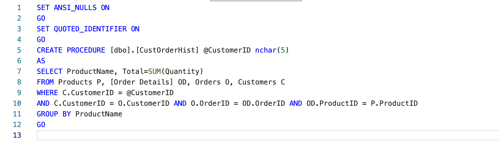

This results in the following results for CustomerID = "ALFKI"

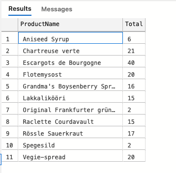

#### CustOrderHist Lift and Shift approach

The first step to lift and shift is to write this query using **SQL++**.  The query would now look like the following:

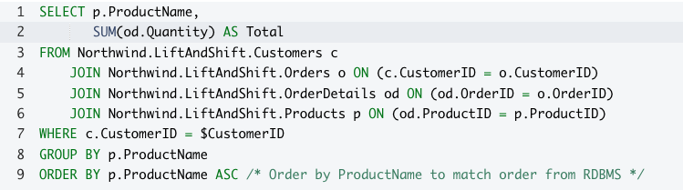

We also created the following indexes to support our queries.  ***As a side note this could be further optimized using USE KEYS but this is the most RDBMS approach***

* CREATE INDEX `idx_customer_custid` ON `Northwind`.`LiftAndShift`.`Customers`(`CustomerID`)
* CREATE INDEX `idx_orders_custid` ON `Northwind`.`LiftAndShift`.`Orders`(`CustomerID`)
* CREATE INDEX `idx_orders_orderid` ON `Northwind`.`LiftAndShift`.`Orders`(`OrderID`)
* CREATE INDEX `idx_ordersdetails_orderid` ON `Northwind`.`LiftAndShift`.`OrderDetails`(`OrderID`)
* CREATE INDEX `idx_ordersdetails_prodid` ON `Northwind`.`LiftAndShift`.`OrderDetails`(`ProductID`)
* CREATE INDEX `idx_products_prodid` ON `Northwind`.`LiftAndShift`.`Products`(`ProductID`,`ProductName`)

With this updated query we can now define a User Defined Function as shown below

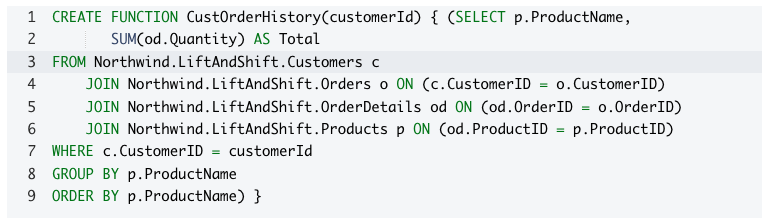

This function can than be run as follows

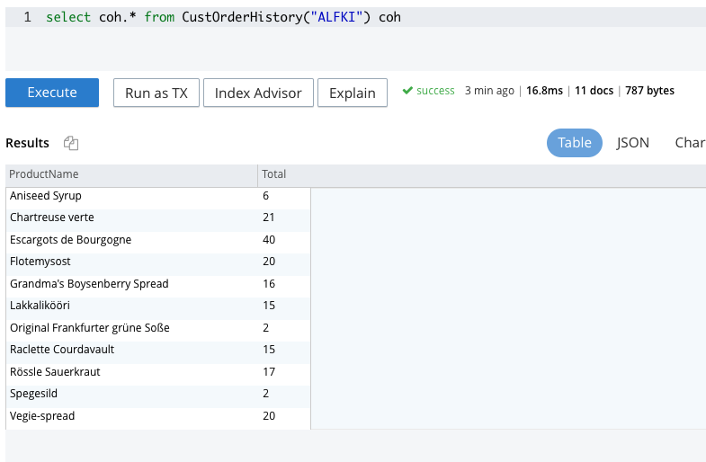

***Alternatively we can make this a named prepared statement as follows***

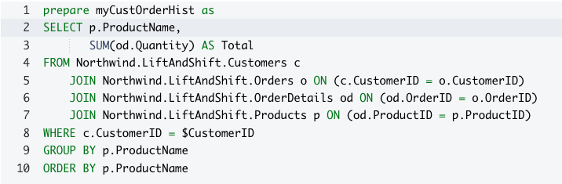

Which can then be executed as follows (We need to set the named parameter customerId to the value we want to pass in either the SDK, Statement, or UI).  In this case we set it in the UI to "ALFKI"

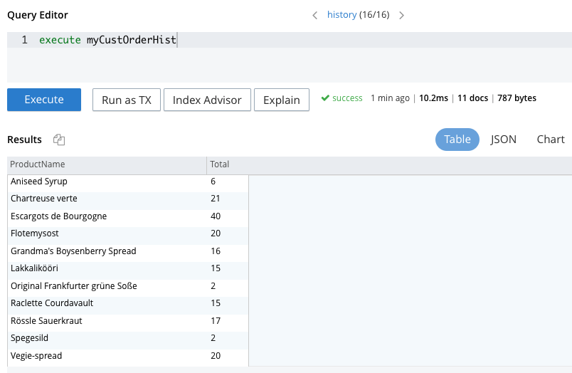

#### CustOrderHist Denormalized

As we noted in the [Data Model](#data-model) section above; with this approach we included all the top level order information with our customer document.  This allows us to re-write this stored procedure with out doing any joins.  The query can be re-written as follows in SQL++

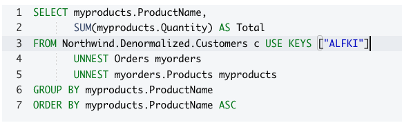

Additionally we can then convert this statement to a named **prepared statement** or a **User Defined Function (UDF)** exactly the same way we did this with the LiftAndShift approach. Either way this query gives us the same results as shown below, and with improved performance going from ~10 ms to ~3 ms in our shared test environment

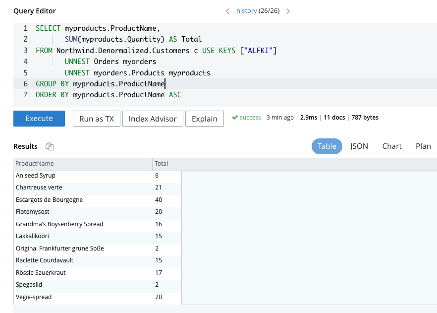

### Stored Procedure - CustOrderDetails

In this stored procedure we get all the products and price information for a given order.  The stored procedure is defined as follows

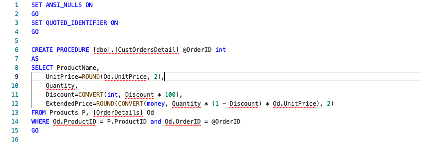

Executing this stored procedure will produce the following results

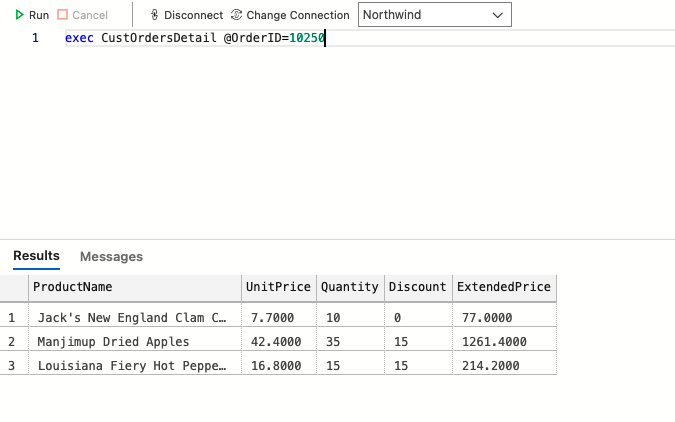

#### CustOrderDetails Lift and Shift approach

This stored procedure can be converted into **SQL++** with the lift and shift approach as shown below

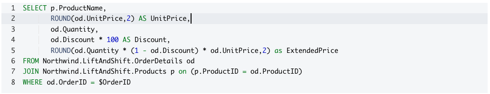

We can then convert the query to either a ***named prepared statement*** and/or a ***user defined function*** similiar to what we did with the previous stored procedure.  Both approaches are shown below:

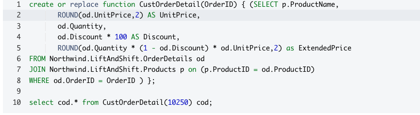

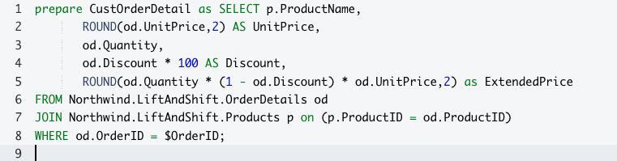

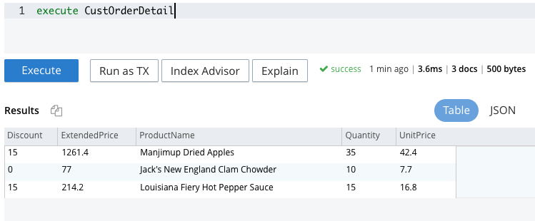

#### CustOrderDetails Denormalized Approach

With the denormalized approach all the information we need is included in the Orders document so we again do not need to perform any joins.  This can be updated as shown below and then either converted to a ***prepared statement*** or a ***user defined function***

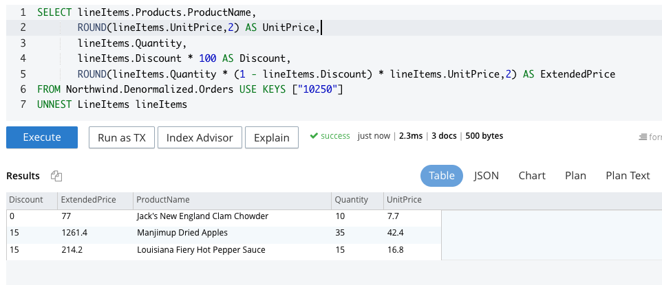

### Stored Procedure - CustOrdersOrders

This stored procedure is a more straight forward query conversion exercise.  We will review what this looks like with both a lift and shift approach as well as denormalized document data model,  but will not show creating a UDF or Named Prepared Query

The Stored Procedure CustOrdersOrders is defined as shown below

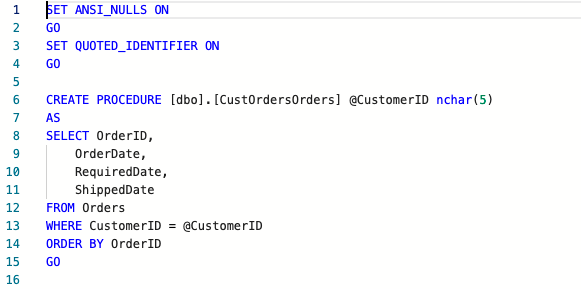

The Lift and Shift approach would look like

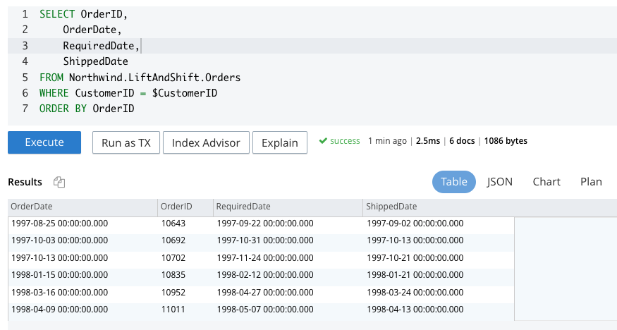

The denormalized approach is very similiar and would look like

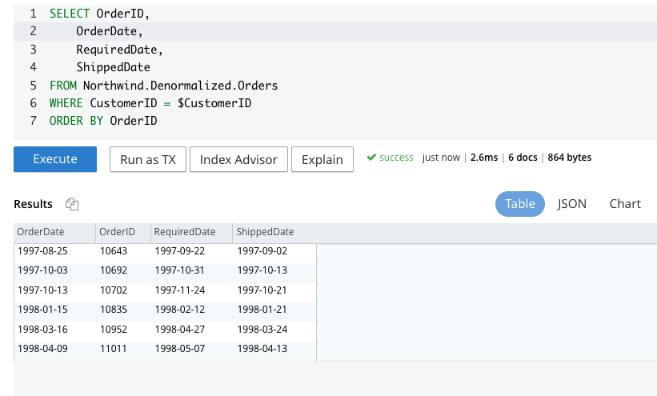

In addition we did create one additional GSI to support this query as

> CREATE INDEX `idx_denorm_orders_custid` ON `Northwind`.`Denormalized`.`Orders`(`CustomerID`)

### Note on remaining stored procedures

***As we have covered how to create user defined procedures (UDFs) and Named Prepared Statements we will not show this for the remaining stored procedures.  Instead we will focus and highlight the approach between RDBMS SQL and NoSQL SQL++***

### Stored Procedure - Employee Sales By Country

This stored procedure is defined as follows

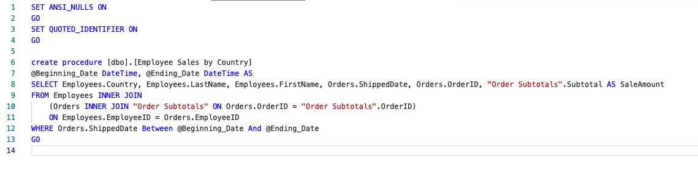

In addition this stored procedure uses the view **Order Subtotals** which is defined as follows

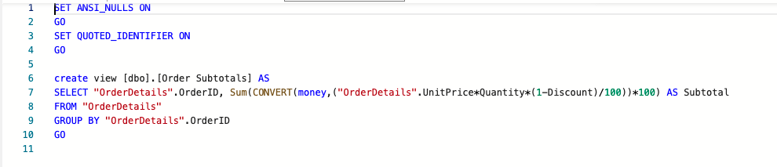

Executing this stored procedure gives us the following Results

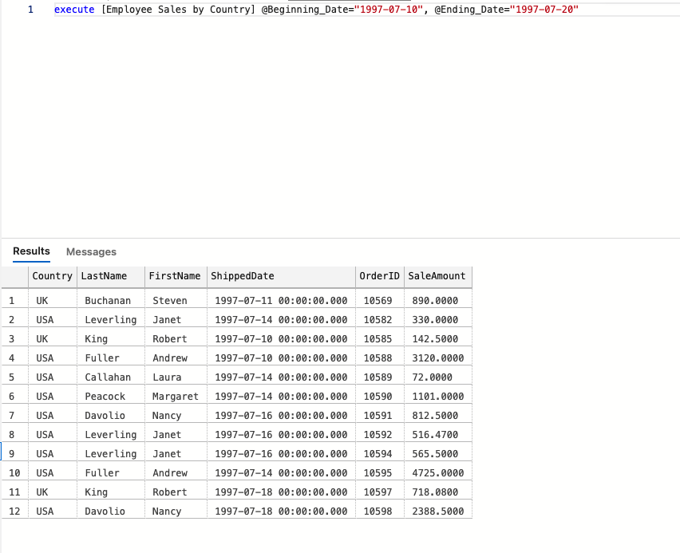

### Employee Sales By Country Lift and Shift

To support this query we will introduce the following two indexes

> CREATE INDEX adv_ShippedDate_OrderID ON `default`:`Northwind`.`LiftAndShift`.`Orders`(`ShippedDate`,`OrderID`)

> CREATE INDEX `idx_las_employee_empid` ON `Northwind`.`LiftAndShift`.`Employees`(`EmployeeID`)

We can write the query as follows:

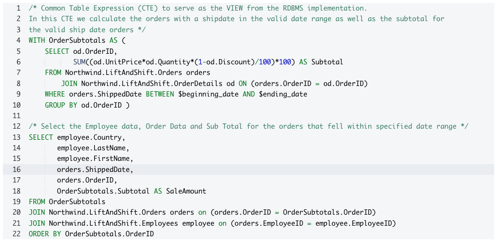

This results in the following results.

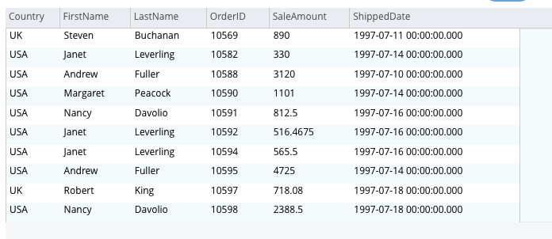

### Employee Sales By Country Denormalized

With this approach we first create the following index

> create index idx_denorm_orders_shipdt on Northwind.Denormalized.Orders(ShippedDate)

We can then update the query as follows

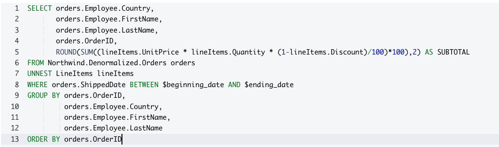

This gives us the following results.

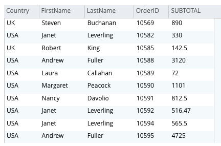

## Appendix

### Customer Order History Statements
> CREATE FUNCTION CustOrderHistory(customerId) { (SELECT p.ProductName,
       SUM(od.Quantity) AS Total
FROM Northwind.LiftAndShift.Customers c
    JOIN Northwind.LiftAndShift.Orders o ON (c.CustomerID = o.CustomerID)
    JOIN Northwind.LiftAndShift.OrderDetails od ON (od.OrderID = o.OrderID)
    JOIN Northwind.LiftAndShift.Products p ON (od.ProductID = p.ProductID)
WHERE c.CustomerID = customerId
GROUP BY p.ProductName
ORDER BY p.ProductName) }

> SELECT p.ProductName,
       SUM(od.Quantity) AS Total
FROM Northwind.LiftAndShift.Customers c
    JOIN Northwind.LiftAndShift.Orders o ON (c.CustomerID = o.CustomerID)
    JOIN Northwind.LiftAndShift.OrderDetails od ON (od.OrderID = o.OrderID)
    JOIN Northwind.LiftAndShift.Products p ON (od.ProductID = p.ProductID)
WHERE c.CustomerID = $CustomerID
GROUP BY p.ProductName
ORDER BY p.ProductName ASC /* Order by ProductName to match order from RDBMS */

> prepare myCustOrderHist as
SELECT p.ProductName,
       SUM(od.Quantity) AS Total
FROM Northwind.LiftAndShift.Customers c
    JOIN Northwind.LiftAndShift.Orders o ON (c.CustomerID = o.CustomerID)
    JOIN Northwind.LiftAndShift.OrderDetails od ON (od.OrderID = o.OrderID)
    JOIN Northwind.LiftAndShift.Products p ON (od.ProductID = p.ProductID)
WHERE c.CustomerID = $CustomerID
GROUP BY p.ProductName
ORDER BY p.ProductName

> SELECT myproducts.ProductName,
       SUM(myproducts.Quantity) AS Total
FROM Northwind.Denormalized.Customers c USE KEYS ["ALFKI"]
       UNNEST Orders myorders
       UNNEST myorders.Products myproducts
GROUP BY myproducts.ProductName
ORDER BY myproducts.ProductName ASC

### Customer Order Details Statements

> SELECT p.ProductName,
       ROUND(od.UnitPrice,2) AS UnitPrice,
       od.Quantity,
       od.Discount * 100 AS Discount,
       ROUND(od.Quantity * (1 - od.Discount) * od.UnitPrice,2) as ExtendedPrice
FROM Northwind.LiftAndShift.OrderDetails od
JOIN Northwind.LiftAndShift.Products p on (p.ProductID = od.ProductID)
WHERE od.OrderID = $OrderID

> prepare CustOrderDetail as SELECT p.ProductName,
       ROUND(od.UnitPrice,2) AS UnitPrice,
       od.Quantity,
       od.Discount * 100 AS Discount,
       ROUND(od.Quantity * (1 - od.Discount) * od.UnitPrice,2) as ExtendedPrice
FROM Northwind.LiftAndShift.OrderDetails od
JOIN Northwind.LiftAndShift.Products p on (p.ProductID = od.ProductID)
WHERE od.OrderID = $OrderID;

> SELECT lineItems.Products.ProductName,
       ROUND(lineItems.UnitPrice,2) AS UnitPrice,
       lineItems.Quantity,
       lineItems.Discount * 100 AS Discount,
       ROUND(lineItems.Quantity * (1 - lineItems.Discount) * lineItems.UnitPrice,2) AS ExtendedPrice
FROM Northwind.Denormalized.Orders USE KEYS ["10250"]
UNNEST LineItems lineItems

### Employee Sales By Country Statements

> CREATE INDEX adv_ShippedDate_OrderID ON `default`:`Northwind`.`LiftAndShift`.`Orders`(`ShippedDate`,`OrderID`)

> CREATE INDEX `idx_las_employee_empid` ON `Northwind`.`LiftAndShift`.`Employees`(`EmployeeID`)

> /* Common Table Expression (CTE) to serve as the VIEW from the RDBMS implementation.
In this CTE we calculate the orders with a shipdate in the valid date range as well as the subtotal for
the valid ship date orders */
WITH OrderSubtotals AS (
    SELECT od.OrderID,
           SUM((od.UnitPrice*od.Quantity*(1-od.Discount)/100)*100) AS Subtotal
    FROM Northwind.LiftAndShift.Orders orders
        JOIN Northwind.LiftAndShift.OrderDetails od ON (orders.OrderID = od.OrderID)
    WHERE orders.ShippedDate BETWEEN $beginning_date AND $ending_date
    GROUP BY od.OrderID )
/* Select the Employee data, Order Data and Sub Total for the orders that fell within specified date range */
SELECT employee.Country,
       employee.LastName,
       employee.FirstName,
       orders.ShippedDate,
       orders.OrderID,
       OrderSubtotals.Subtotal AS SaleAmount
FROM OrderSubtotals
JOIN Northwind.LiftAndShift.Orders orders on (orders.OrderID = OrderSubtotals.OrderID)
JOIN Northwind.LiftAndShift.Employees employee on (orders.EmployeeID = employee.EmployeeID)
ORDER BY OrderSubtotals.OrderID

> create index idx_denorm_orders_shipdt on Northwind.Denormalized.Orders(ShippedDate)

> SELECT orders.Employee.Country,
       orders.Employee.FirstName,
       orders.Employee.LastName,
       orders.OrderID,
       ROUND(SUM((lineItems.UnitPrice * lineItems.Quantity * (1-lineItems.Discount)/100)*100),2) AS SUBTOTAL
FROM Northwind.Denormalized.Orders orders
UNNEST LineItems lineItems
WHERE orders.ShippedDate BETWEEN $beginning_date AND $ending_date
GROUP BY orders.OrderID, orders.Employee.Country, orders.Employee.FirstName, orders.Employee.LastName
ORDER BY orders.OrderID
