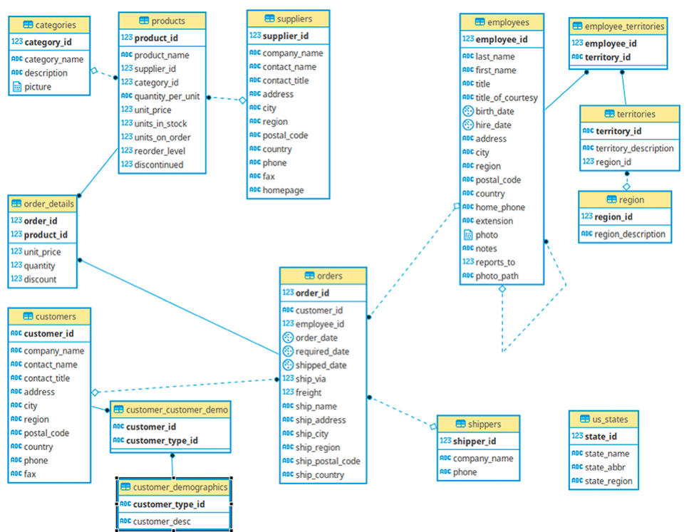
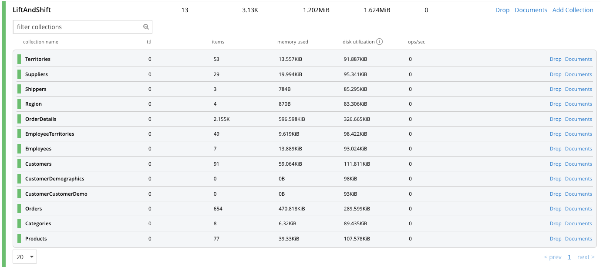
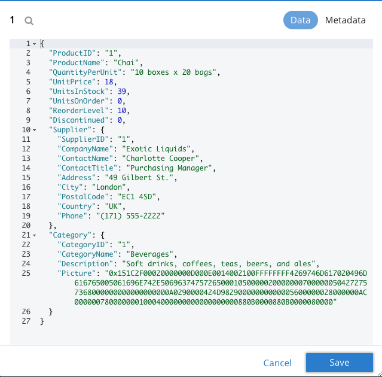
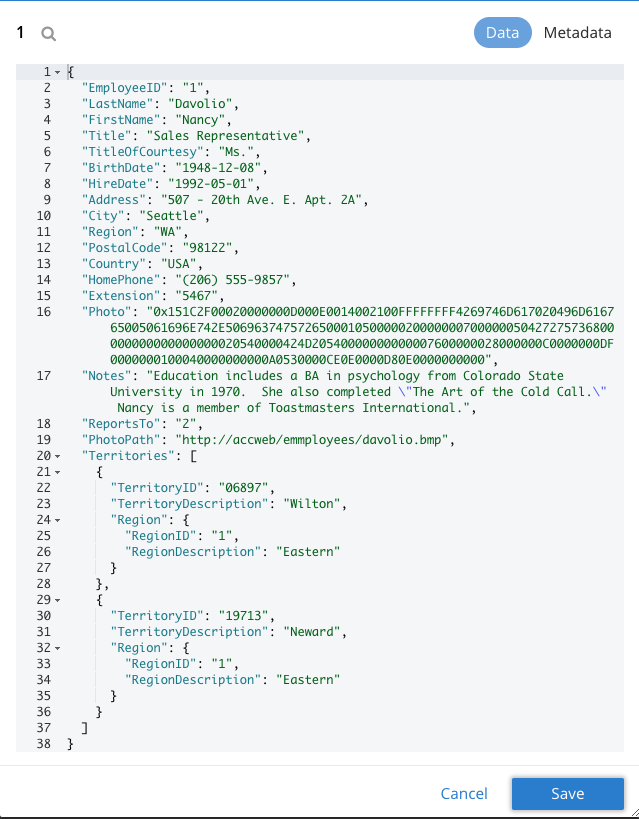
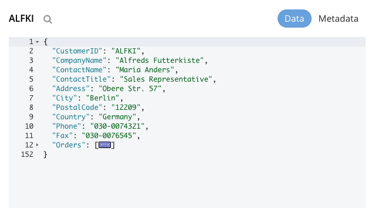
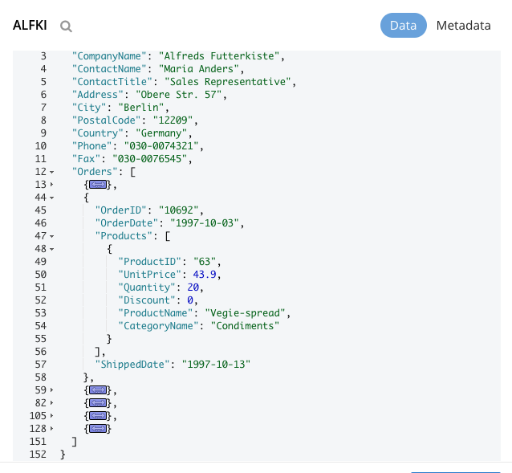
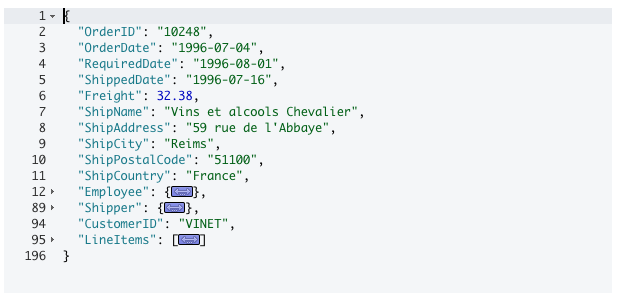
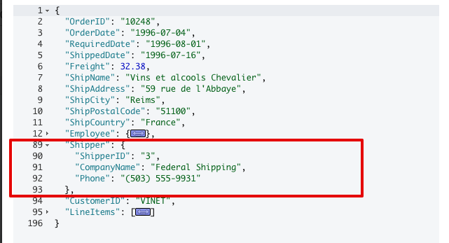
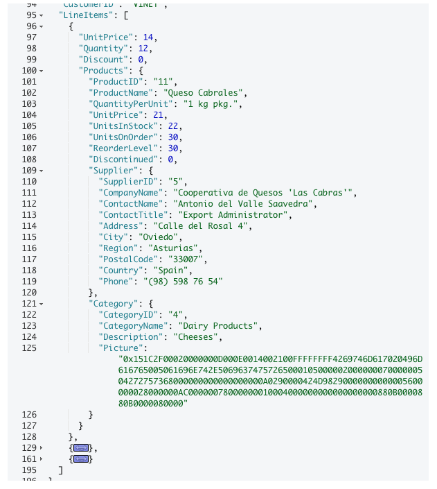

# Northwind Data Model on Couchbase

This repository documents migrating the Northwind data model from an RDBMS system to Couchbase.

This process is implemented in two different phases to highlight the flexibility and design decisions of NoSQL and Couchbase in particular.

## Table of content

* [Data Model](#data-model)
* [Migrating Stored Procedures](#migrating-stored-procedures)

## Data model

### RDBMS Data model

This is the RDBMS data model that was used for this exercise.

### Couchbase Phase 1 - Lift and Shift

With this approach we kept the data model consistent with the RDBMS model and set up the following scopes and collections to map to the existing schema and tables.

### Couchbase Phase 2 - Denormalize the Data

In this approach we take advantage of the document structure of Couchbase.  In this example we denormalize the data into the following document types:

- Reference Data
- Employee Data
- Order Data
- Customer Data

The **Reference Data** is comprised of the Product information with the following example document

The **Employee Data** is the denormalized data of Employee, Territories, and Region from the SQL Server model.  A sample document for employee is shown below

The **Customer Data** includes the customer information as well as top level items for each order and line item.  The top level JSON document is structured as shown below

The orders array contains top level order information for the customer as shown in the below image

And finally the **Orders Data** this is the largest document which contains full information for not just the Order,  but the products for each line item,  the employee involved in the order,  the shipping company, etc...

An example of the top level document is shown below

The _employee_ object is the same Employee data that was previously documented.  The _shipper_ object is shown below

And finally the LineItems which contain all the product information for each line item in this order.  An example of this is shown below

## Migrating Stored Procedures

In this section we discuss existing stored procedures in SQL Server and how they are translated to Couchbase as both a Lift and Shift as well as a denormalized document model.
